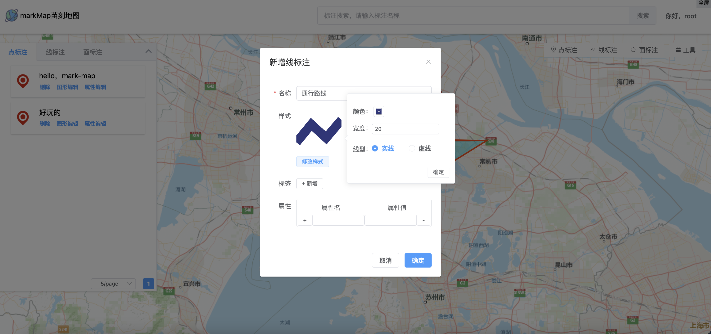

## 简介

markMap苗刻地图是一款开源的、前后端分离的地图标注平台。用户可以在平台中标注位置、描述、文件等信息，并实现分享。

默认仅需node环境 + sqlite，无需额外数据库环境，无需手动初始化数据库，clone后安装依赖即可运行。仅需修改数行配置文件，也可自行修改替换为mysql、postgreSQL等其他关系型数据库。


#### 部分截图



## 技术选型

前端：vite + vue3 + maptalks + element-plus + tailwindcss

后端：nodejs + koa2 + sequelize + sqlite

依赖于sequelize，也可自行将sqlite替换为mysql、postgreSQL等其他关系型数据库，仅需修改```mark-map-server/src/models/install.js```中的实例化函数，在此不赘述


## 开发环境启动

#### 前端

```shell
cd mark-map-web
npm install # 或 yarn install
npm run dev
```

#### 后端

修改mark-map-server/src/config.js配置文件【重要，其中serverUrl必须修改为正确url，否则上传文件和图片不能正确返回】；

然后

```shell
cd mark-map-server
npm install # 或 yarn install
npm run dev
```

## 部署环境

#### 前端

```shell
cd mark-map-web
npm install # 或 yarn install
npm run build
```

然后，将dist拷贝到服务器并配置

#### 后端

将后端代码上传至服务器

然后

```shell
cd mark-map-server
npm install # 或 yarn install
npm run server
```

